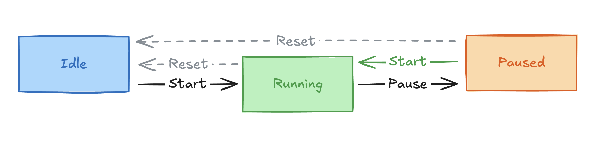

# 타이머 구현

## 실행 방법

```zsh
npm install
npm run dev
npx vitest
```

## 상태 모델

타이머 상태를 `idle | running | paused` 세 가지로 정의했습니다.




## 시간 계산

### 왜 tick 누적이 아닌가

`setInterval(fn, 1000)`은 정확히 1000ms마다 실행되지 않습니다. 1000ms 후 콜백이 macrotask queue에 등록되지만, 이벤트 루프가 이를 꺼내 실행하려면 콜스택이 비어 있어야 합니다. 콜스택에 다른 작업이 남아 있으면 그만큼 지연되어 수~수십ms씩 밀립니다. 매 tick마다 `elapsed += 1`로 카운트하면 이 오차가 누적되어 1분 이상 실행 시 눈에 띄는 차이가 납니다.

그래서 `elapsed = accumulated + (now() - startTime)` 방식으로 시스템 시계 차이를 구했습니다. setInterval이 950ms 후에 실행되든 1050ms 후에 실행되든, 표시하는 값은 시스템 시계 기준이기 때문에 항상 정확합니다. interval은 "화면 갱신 트리거" 역할만 합니다.

### performance.now()

`Date.now()`는 밀리초 정밀도이고 NTP 동기화 등 시스템 시계 조정의 영향을 받습니다. `performance.now()`는 마이크로초 정밀도의 모노토닉 클럭이라 외부 시계 조정과 무관합니다.

경과 시간은 `now() - startTime` 차이로 구하기 때문에 상대값으로 충분합니다. `performance.timeOrigin`(≈1.7×10¹²)을 더하면 부동소수점 유효자리수 한계로 오히려 정밀도를 잃고, 컴퓨터가 절전에서 깨어나면 `timeOrigin + now()`가 실제 시각과 맞지 않는 [issue](https://github.com/getsentry/sentry-javascript/issues/2590)도 있기 때문에 `performance.now()` 단독으로 사용했습니다.

### setInterval vs requestAnimationFrame

rAF는 비활성 탭에서 완전히 멈춥니다. 타이머 앱은 백그라운드에서도 시간이 흘러야 자연스럽다고 생각했습니다. 그리고 요구사항이 **초 단위 카운트업**이어서, rAF를 쓰면 매 프레임(60fps) loop를 돌리면서 "초가 바뀌었나?"만 확인하는 오버엔지니어링이 됩니다. setInterval(1000)이면 브라우저가 알아서 1초 뒤에 깨워줍니다. rAF가 의미 있으려면 센티초/밀리초 단위로 빠르게 표시가 갱신되는 UI일 때입니다.

## React 설계

### ref와 state 분리

ref는 값이 바뀌어도 리렌더가 발생하지 않습니다. `accumulated`, `startTime`, `goalNotified`는 내부 계산용이라 화면에 직접 쓰이지 않으므로 ref로 관리하고, `status`와 `elapsed`만 state로 둬서 변경 시에만 리렌더가 일어나게 했습니다.

처음에는 status도 ref에 중복으로 두고 있었습니다. `useCallback(fn, [])`에서 stale closure를 피하려고 `ref.current.status`를 읽는 방식이었는데, 그러면 ref와 state의 status를 항상 수동으로 동기화해야 하는 관리 포인트가 생깁니다.

그래서 `ref.current.status`를 제거하고 `state.status`를 직접 읽되, `useCallback` deps에 `state.status`를 넣는 방식으로 바꿨습니다. status가 바뀔 때 함수가 재생성되지만, 어차피 그 시점에 리렌더가 일어나는 타이밍이라 추가 비용이 아닙니다.

### setState updater 안에 side effect를 넣지 않는 이유

React StrictMode에서 `setState(prev => ...)` updater는 순수성 검증을 위해 두 번 호출될 수 있습니다. 이 안에서 `ref.current.accumulated += ...` 같은 side effect를 수행하면 값이 이중으로 누적됩니다. side effect는 updater 바깥(이벤트 핸들러 본문)에서 수행하고, updater는 순수하게 유지했습니다.

## feat/external-store 브랜치

main에서 ref + state 이중 관리가 신경 쓰여서, `useSyncExternalStore`로 구조를 바꿔본 브랜치입니다.

### 추가한 이유

ref 기반 방식의 불편한 점은 렌더링용 state와 내부 계산용 ref가 공존하면서, 어떤 값을 어디서 읽어야 하는지 매번 판단해야해서 관리 포인트가 늘어나는 점입니다. status처럼 양쪽에 필요한 값은 동기화 문제가 생깁니다.

### 구조

타이머 상태를 React 바깥의 `TimerStore` 클래스로 꺼냈습니다. store가 single source of truth이고, React는 `useSyncExternalStore`로 구독만 합니다.

```ts
// store가 모든 상태를 관리
class TimerStore {
  private status: TimerStatus = 'idle';
  private accumulated = 0;
  private startTime = 0;

  start = () => { this.status = 'running'; this.emit(); };
}

// 또는 구독만
function useTimer(goalSeconds) {
  store.setGoalSeconds(goalSeconds);
  const snapshot = useSyncExternalStore(store.subscribe, store.getSnapshot);
  return { ...snapshot, start: store.start, pause: store.pause, reset: store.reset };
}
```

이렇게 하면:
- ref + state 이중 관리가 사라집니다. store 하나가 SSOT 가 됩니다.
- `store.start`는 항상 같은 참조라 useCallback이 필요 없습니다.
- concurrent mode에서 tearing(렌더 도중 상태가 바뀌어 UI 불일치)이 발생하지 않습니다.

### 왜 main 브랜치에서는 적용하지 않았는지?

이 타이머에서 store의 이점이 실질적으로 드러나려면 여러 컴포넌트가 동시에 같은 타이머를 구독하는 상황이어야 합니다. 현재는 App 하나뿐이라 오버엔지니어링이라고 생각했습니다.
그리고 interval lifecycle을 useEffect가 자동으로 관리해주는 ref 기반과 달리, store에서는 직접 관리해야 합니다. 구독자가 0명이 되면 interval을 멈추고, 다시 구독되면 재개하는 로직이 추가됩니다.
구조적으로는 깔끔하지만 이 규모에서는 main의 방식이 더 적합하다고 판단했습니다.

## 한계

- setInterval은 메인 스레드가 block되면 tick이 지연됩니다. 하지만 최종 시간은 performance.now() 기준이므로 정확합니다.
- performance.now()는 컴퓨터 슬립 시 멈출 수 있다고 합니다.
- 대규모 앱에서 렌더 비용이 문제가 된다면 useSyncExternalStore로 구독 구조를 분리 또는 Web Worker로 메인 스레드 부담을 줄이는 방향을 고려할 수 있습니다.

## 구조

```
src/
├── time.ts              # performance.now() util함수, formatTime, TICK_INTERVAL_MS
├── hooks/
│   ├── useTimer.ts      # 타이머 로직 (상태 + 시간 계산) 관리 custom hook
│   └── useInterval.ts   # setInterval 관리 custom hook
├── App.tsx
├── App.css
└── index.tsx
```
